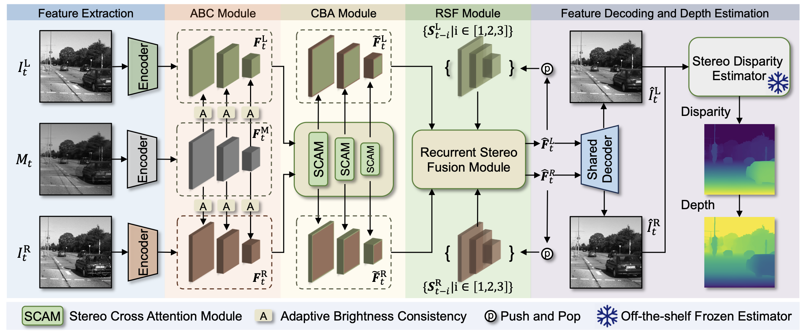

# [CVPR 2026] 240FPS Stereo Vision from Monocular Mixed Spikes

Yeliduosi Xiaokaiti, Yakun Chang,
Yang Bai, Zhaojun Huang,
Peiqi Duan, Boxin Shi<sup>*</sup>

Official PyTorch implementation of **MonoSpikeStereo**.



## Abstract

Stereo vision is fundamental for enabling machines to perceive and interact with
the world. While monocular stereo methods offer hardware compactness, they
struggle with generalization due to reliance on data-driven priors. Binocular
and multi-view systems improve accuracy but incur higher hardware complexity and
data inefficiency.
In this paper, we introduce a monocular solution for high-frame-rate stereo
vision via temporal optical modulation. The modulation directs light from two
views onto a single sensor in a mixed manner, while periodically attenuating one
view at 60 Hz. To capture the temporal variations introduced by this
modulation, we employ a high-speed spike camera that records the mixed scene as
temporally dense spikes. The high temporal resolution of these spikes enables
the construction of a linear system for efficient binocular video decoupling.
Consequently, we introduce a two-stage decoding methodology for achieving
high-quality stereo vision: an efficient least-squares-based baseline
reconstruction followed by a deep learning refinement module.
Experimental results demonstrate that our approach achieves 240 FPS binocular
video reconstruction with superior accuracy compared to monocular systems,
while maintaining hardware compactness and data efficiency.

## Installation

### Prerequisites

The code has been tested in the following environment:

- CUDA: 12.4
- PyTorch: 2.2.2
- Python: 3.10.14

### Steps

Clone the repository:

```bash
git clone https://github.com/yongqiye00/MonoSpikeStereo.git
cd MonoSpikeStereo
```

Set up a virtual environment:

```bash
conda create -n monospikestereo python=3.10
conda activate monospikestereo
```

Install dependencies:

```bash
pip install -r requirements.txt
```

Run a quick sanity check with the sample NPZ included in
`data/samples/test_npz/` and the checkpoint at
`checkpoints/monospikestereo.pth`:

```bash
python test.py --config configs/test/test_sample.yaml
python inference.py --config configs/inference/inference_sample.yaml
```

## Dataset

We use [TartanAir](https://tartanair.org/) as the source dataset. The source
sequences are first upsampled with RAFT-based optical-flow interpolation
([RAFT](https://github.com/princeton-vl/RAFT)), and then converted to mixed
spike sequences with our spike-camera simulation pipeline.
Download the RAFT checkpoint from the RAFT project and place it at
`preprocessing/RAFT/models/raft-things.pth` before running interpolation.

Several full-resolution examples for testing and raw-spike inference will be
released through Google Drive. Place the downloaded NPZ files under
`data/test_npz/` and use the default test and inference configs below.

The preprocessing scripts are included under `preprocessing/`. The typical
pipeline is:

```bash
python preprocessing/run_preprocessing.py --pipeline tartanair_interpolate \
    --config preprocessing/config/tartanair_interpolate.yaml

python preprocessing/run_preprocessing.py --pipeline tartanair_simulation \
    --config preprocessing/config/tartanair_simulation.yaml
```

The interpolation stage uses the RAFT source code vendored in
`preprocessing/RAFT/core/`. To use a different checkpoint location, pass
`--set raft_model_path=/path/to/raft-things.pth`. Paths and other preprocessing
options can also be edited in `preprocessing/config/`.


## Training

```bash
python train.py --config configs/train/train.yaml
```

## Testing

```bash
python test.py --config configs/test/test.yaml
```

## Inference

```bash
python inference.py --config configs/inference/inference.yaml
```

## Depth Estimation

In the paper, depth estimation is performed with
[DEFOM-Stereo](https://github.com/Insta360-Research-Team/DEFOM-Stereo) and
[CREStereo](https://github.com/megvii-research/CREStereo).

## Citation

## Acknowledgements

This repository uses the [TartanAir](https://tartanair.org/) dataset and the
[RAFT](https://github.com/princeton-vl/RAFT) optical-flow code for data
preprocessing.

## License

This project is licensed under the MIT License. See the LICENSE file for more
details.
